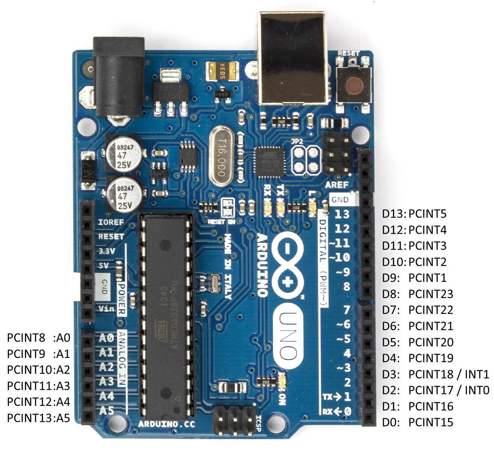

PinChangeInterrupt Library 1.1
==============================



New PinChangeInterrupt with a very resource friendly implementation.
PinChangeInterrupts are a bit slower than normal Pin Interrupts because of the pin change comparison
but this library tries to reduce this disadvantage to a minimum, even with an user friendly API.
Compared with the normal Interrupts it is even more compact and all available PCINTs can be used.

**Features:**
* PinChangeInterrupt for a lot of pins
* Rising, Falling or Change detection for every pin separately
* Usable on every standard Arduino and Attiny as well
* Uses less ram & flash than normal Interrupts
* Implementation is fast and compact
* Ports can be manually deactivated in the .h file

**The following pins are usable for PinChangeInterrupt:**
* Arduino Uno: you can use all pins for PinChangeInterrupt.
* Arduino Mega: 10, 11, 12, 13, 14, 15, 50, 51, 52, 53, A8 (62), A9 (63), A10 (64), A11 (65), A12 (66), A13 (67), A14 (68), A15 (69)
* Arduino Leonardo: 8, 9, 10, 11, 14 (MISO), 15 (SCK), 16 (MOSI)
* HoodLoader2: you can use all (broken out 1-7) pins for PinChangeInterrupt.
* Attiny 24/44/84: you can use all pins for PinChangeInterrupt.
* Attiny 25/45/85: you can use all pins for PinChangeInterrupt.

**[Comment for feedback on my blog.](www.nicohood.de)**

Installation/How to use
=======================

Download the zip, extract and remove the "-master" of the folder.
Install the library [as described here](http://arduino.cc/en/pmwiki.php?n=Guide/Libraries).

As normal user you might wonder what I am talking about, maybe you should read how PinChangeInterrupts work.
Its really important to understand what your are using.

### Basic example
The basic example shows you how the library and its syntax work.

You can attach your pins with the attach function and the digitalPinToPinChangeInterrupt(p) definition.
Make sure your attached pin is actually a PinChangeInterrupt as listed above.

Keep in mind that on Arduino Mega the definition excludes some pins like 14 (TX3) and 15 (RX3).
You can still use them by manually passing attachPinChangeInterrupt(PCINT10, CHANGE);

PinChangeInterrupts are always executed after each other. Make sure that the functions are short and have no Serial prints nor delay in it.
Lower pin numbers on a port are executed faster. This means PCINT0 is faster than PCINT7. PCINT8 is on another port (port 1) is faster than PCINT15 for example.

PinChangeInterrupts trigger for pin changes on a whole port so we have to check the difference between the last interrupt.
That's why we also have in general a **delay between the interrupt call and the actual function execution**.

### IRLremote example

To test the IRLremote example install the IRLremote:
https://github.com/NicoHood/IRLremote

This demonstrates how to use the PinChangeInterrupt library together with the IRLremote library. This can be useful if you are running out if normal
interrupt pins or don't have them at all (HoodLoader2). The PinChangeInterrupt library is also smaller than the normal Interrupt library, just a tiny bit slower.


More projects + contact can be found here:
www.nicohood.de

How it works
============

Coding a PCINT library is kind of tricky. At least if you want to keep flash and ram size low, as I always try to do ;)
There are two main challenges: compare the old values with the new values as fast as you can but still be able to get a RISING, FALLING, CHANGE for every port
and somehow start the function the user wants to use.

The first challenge about the comparison is solved this way: we always compare a whole port at once. This saves us a lot of cpu cycles and also ram.
We only need 1 byte for the old port state, the rising and the falling setting each. CHANGE is interpreted as rising or falling, so both settings are set to 1.
The rest is a bit of clever bit calculation to get the triggers for the whole port.

The hardest challenge was to find a way to start the user functions. Should we save a function pointer array with up to 24 entries? That would cost 48 bytes of ram,
some overhead for 24 functions of which the user might use 1-3. It took me some time to realize a different solution. What if we put the function pointers into PROGEMEM?
They point by default to a useless function and are all implemented weak. Meaning you can overwrite them if you want to.
The user now only has to implement a strong function in his .ino file. The problem here is the digitalPin -> PCINT conversion which is done with some tricky macros.
The downside is that the user pin can only be passed as a #define not with a const int because of that macro. And it takes a bit more work in the lib to define the pins for all boards.
But if you want to we could simply switch the pointers to ram and be more flexible.

On top of that is a logic of #defines which dynamically enable and disable not used ports - selected by the user or as limit by the chip itself.
It automatically uses only the ram for the available and enabled ports and also only checks them. Its a bit tricky and hard to explain, you should just have a look
at the code if you are interested. You should also know that AVRs with 4 PCINT ports (0-3) are not compatible yet because this would need a huge change to the definitions and
none of the 'standard' MCU's has 4 PCINT ports. Another advantage is that we use the actual hardware numbers of the PCINTs and no pin numbers which we had to convert again.
That saves us flash and the pin mapping is done by a definition from pin -> pcint, not vice versa. Due to the inline this mapping is also very small.

That's it! I hope you like the library. I tried to make it as simple and small as possible. Keep in mind that PCINTs are not useful for every project but in most cases
the new PinChangeInterrupts may help you a lot.

Version History
===============
```
1.2 Release (xx.02.2015)
* Added Progmem pointers
* Improved interrupt function calls
* Changed the digitalPinToPinChangeInterrupt(p) macro

1.1 Release (06.12.2014)
* Added port deactivation
* Ram usage improvements for AVRs with <3 PCINT ports

1.0 Release (04.12.2014)
* Added general PinChangeInterrupt functions
* Added support for most Arduino boards
* Added basic example
* Added an example with IRLremote
```


Licence and Copyright
=====================
If you use this library for any cool project let me know!

```
Copyright (c) 2014 NicoHood
See the readme for credit to other people.

Permission is hereby granted, free of charge, to any person obtaining a copy
of this software and associated documentation files (the "Software"), to deal
in the Software without restriction, including without limitation the rights
to use, copy, modify, merge, publish, distribute, sublicense, and/or sell
copies of the Software, and to permit persons to whom the Software is
furnished to do so, subject to the following conditions:

The above copyright notice and this permission notice shall be included in
all copies or substantial portions of the Software.

THE SOFTWARE IS PROVIDED "AS IS", WITHOUT WARRANTY OF ANY KIND, EXPRESS OR
IMPLIED, INCLUDING BUT NOT LIMITED TO THE WARRANTIES OF MERCHANTABILITY,
FITNESS FOR A PARTICULAR PURPOSE AND NONINFRINGEMENT. IN NO EVENT SHALL THE
AUTHORS OR COPYRIGHT HOLDERS BE LIABLE FOR ANY CLAIM, DAMAGES OR OTHER
LIABILITY, WHETHER IN AN ACTION OF CONTRACT, TORT OR OTHERWISE, ARISING FROM,
OUT OF OR IN CONNECTION WITH THE SOFTWARE OR THE USE OR OTHER DEALINGS IN
THE SOFTWARE.
```
