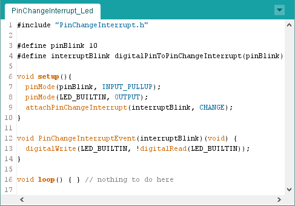

PinChangeInterrupt Library 1.2.6
================================



PinChangeInterrupt library with a resource friendly implementation (API and LowLevel).
PinChangeInterrupts are different than normal Interrupts. See detail below.

##### Features:
* PinChangeInterrupt for a lot of pins
* Rising, Falling or Change detection for every pin separately
* Usable on a lot Arduino compatible boards
* Implementation is fast, compact and resource friendly
* Ports/Pins can be manually deactivated in the Settings file
* API and LowLevel option
* Full Port0-3 support
* .a linkage optimization (Arduino IDE)

#### Supported pins for PinChangeInterrupt:
See [PCINT pin table](https://github.com/NicoHood/PinChangeInterrupt/#pinchangeinterrupt-table) at the bottom for more details.

```
 Arduino Uno/Nano/Mini: All pins are usable  
 Arduino Mega: 10, 11, 12, 13, 50, 51, 52, 53, A8 (62), A9 (63), A10 (64),
               A11 (65), A12 (66), A13 (67), A14 (68), A15 (69)
 Arduino Leonardo/Micro: 8, 9, 10, 11, 14 (MISO), 15 (SCK), 16 (MOSI)
 HoodLoader2: All (broken out 1-7) pins are usable
 Attiny 24/44/84: All pins are usable
 Attiny 25/45/85: All pins are usable
 Attiny 13: All pins are usable
 Attiny 441/841: All pins are usable
 ATmega644P/ATmega1284P: All pins are usable
```

Contact information can be found here:

www.nicohood.de

Installation
============

Download the zip, extract and remove the "-master" of the folder.
Install the library [as described here](http://arduino.cc/en/pmwiki.php?n=Guide/Libraries).

This library can also be used with the [DMBS AVR Library Collection](https://github.com/NicoHood/avr) and a pure makefile.

How to use
==========

It is important that you know at least the basic difference between **PinInterrupts** and **PinChangeInterrupts**.
I will explain the basics of **PinChangeInterrupts** (PCINTs) based on an Arduino Uno.

On a standard Arduino Uno Pin 2 and 3 have **PinInterrupts**. Those are exclusively for a single pin and can detect RISING, FALLING and CHANGE.

**PinChangeInterrupts** instead are used for a whole port (they should have better named them PortChangeInterrupts) and can only detect CHANGE for a whole port.
Each pin row (0-7, 8-13, A0-A5) represents a port. If an interrupt (ISR) occurs on one pin of a port
it is still unclear what pin of the port caused this interrupt. Therefore this library saves the state of the whole port and compares with the last state.
This way we can also see if it was a RISING or FALLING edge instead of only knowing the CHANGE.

A **PinChangeInterrupt** will only be triggered for the attached pins per port.
Meaning if you set PCINT for a pin and another pin on the same port is changing a lot
it will not interrupt your code.

**PinChangeInterrupts** might be a tiny bit slower and not that reliable because of that detection overhead (talking about micro seconds).
Make sure to not use longer function calls inside the ISR or Serial print.
You have the same issues on normal **PinInterrupts** and interrupts in general.

The library is coded to get maximum speed and minimum code size. The LowLevel example without the API takes 4uS to enter the interrupt function in the worst case
which is pretty good and might be even better than the **PinInterrupt** code from the official Arduino core due to high optimization.
If you need very precise interrupts you better use **PinInterrupts** without the Arduino IDE at all.

### Examples
To see how the code works just check the Led and TickTock example.
The LowLevel example is for advanced users with more optimization and more direct access.
The HowItWorks example shows the basic PinChangeInterrupt setup and decoding routine, similar to the library.
See the notes in the examples about more details.

An useful "real use" example of the PinChangeInterrupt library can be found here:
https://github.com/NicoHood/IRLremote

### API Reference

##### Attach a PinChangeInterrupt
```cpp
// The pin has to be a PCINT number. Use the makro to convert a pin to a PCINT number.
// Enables event functions which need to be defined in the sketch.
// Valid interrupt modes are: RISING, FALLING or CHANGE
attachPinChangeInterrupt(digitalPinToPinChangeInterrupt(pinTick), tick, RISING);

// You can also input the PCINT number (see table below)
attachPinChangeInterrupt(5, tock, FALLING);

// PinChangeInterrupt can always be abbreviated with PCINT
attachPCINT(digitalPinToPCINT(pinBlink), blinkLed, CHANGE);
```

##### Detach a PinChangeInterrupt
```cpp
// Similar usage as the attachPCINT function.
// Interrupts will no longer occur.
detachPinChangeInterrupt(digitalPinToPinChangeInterrupt(pinTick));
detachPinChangeInterrupt(5);
detachPCINT(digitalPinToPCINT(pinTock));
```

##### Enable/Disable a PinChangeInterrupt
```cpp
// Similar usage as the attachPCINT function.
// Use this to temporary enable/disable the Interrupt
disablePinChangeInterrupt(digitalPinToPinChangeInterrupt(pinTick));
disablePinChangeInterrupt(5);
disablePCINT(digitalPinToPCINT(pinBlink));

// Enable the PCINT with the old settings again (function + mode)
enablePinChangeInterrupt(digitalPinToPinChangeInterrupt(pinTick));
enablePinChangeInterrupt(5);
enablePCINT(digitalPinToPCINT(pinBlink));
```

##### Get Trigger on mode CHANGE
```cpp
// Differenciate between RISING and FALLING on mode CHANGE.
// Only use this in the attached interrupt function.
uint8_t trigger = getPinChangeInterruptTrigger(digitalPinToPCINT(pinTick));
if(trigger == RISING)
  // Do something
else if(trigger == FALLING)
  // Do something
else
  // Wrong usage (trigger == CHANGE)
```

##### LowLevel API
See [LowLevel example](examples/PinChangeInterrupt_LowLevel/PinChangeInterrupt_LowLevel.ino) for more details.
```cpp
// Use the attach function as you are used to, just leave out the function name
attachPinChangeInterrupt(interruptBlink, CHANGE);

// LowLevel function that is called when an interrupt occurs for a specific PCINT.
// It is required to know the exact PCINT number, no Arduino pin number will work here.
void PinChangeInterruptEvent(5)(void) {
  // Do something
}
```

PinchangeInterrupt Table
========================
Pins with * are not broken out/deactivated by default.
You may activate them in the setting file (advanced).

Each row section represents a port(0-3).
Not all MCUs have all Ports/Pins physically available.

#### Official Arduinos
```
| PCINT |  Uno/Nano/Mini  |   Mega/2560    | Leonardo/Micro | HL2 (8/16/32u2) |
| ----- | --------------- | -------------- | -------------- | --------------- |
|     0 |  8       (PB0)  | 53 SS   (PB0)  |    SS   (PB0)* |  0 SS   (PB0)*  |
|     1 |  9       (PB1)  | 52 SCK  (PB1)  |    SCK  (PB1)  |  1 SCK  (PB1)   |
|     2 | 10 SS    (PB2)  | 51 MOSI (PB2)  |    MOSI (PB2)  |  2 MOSI (PB2)   |
|     3 | 11 MISO  (PB3)  | 50 MISO (PB3)  |    MISO (PB3)  |  3 MISO (PB3)   |
|     4 | 12 MOSI  (PB4)  | 10      (PB4)  |  8/A8   (PB4)  |  4      (PB4)   |
|     5 | 13 SCK   (PB5)  | 11      (PB5)  |  9/A9   (PB5)  |  5      (PB5)   |
|     6 |    XTAL1 (PB6)* | 12      (PB6)  | 10/A10  (PB6)  |  6      (PB6)   |
|     7 |    XTAL2 (PB7)* | 13      (PB7)  | 11      (PB7)  |  7      (PB7)   |
| ----- | --------------- | -------------- | -------------- | --------------- |
|     8 | A0       (PC0)  |  0 RX   (PE0)* |                |         (PC6)*  |
|     9 | A1       (PC1)  | 15 RX3  (PJ0)* |                |         (PC5)*  |
|    10 | A2       (PC2)  | 14 TX3  (PJ1)* |                |         (PC4)*  |
|    11 | A3       (PC3)  |    NC   (PJ2)* |                |         (PC2)*  |
|    12 | A4 SDA   (PC4)  |    NC   (PJ3)* |                |         (PD5)*  |
|    13 | A5 SDC   (PC5)  |    NC   (PJ4)* |                |                 |
|    14 |    RST   (PC6)* |    NC   (PJ5)* |                |                 |
|    15 |                 |    NC   (PJ6)* |                |                 |
| ----- | --------------- | -------------- | -------------- | --------------- |
|    16 |  0 RX    (PD0)  | A8      (PK0)  |                |                 |
|    17 |  1 TX    (PD1)  | A9      (PK1)  |                |                 |
|    18 |  2 INT0  (PD2)  | A10     (PK2)  |                |                 |
|    19 |  3 INT1  (PD3)  | A11     (PK3)  |                |                 |
|    20 |  4       (PD4)  | A12     (PK4)  |                |                 |
|    21 |  5       (PD5)  | A13     (PK5)  |                |                 |
|    22 |  6       (PD6)  | A14     (PK6)  |                |                 |
|    23 |  7       (PD7)  | A15     (PK7)  |                |                 |
| ----- | --------------- | -------------- | -------------- | --------------- |
```

#### Atmel Attinys
```
| PCINT |   Attiny13   |    Attiny x4    |   Attiny x5   |     Attiny x41      |
| ----- | ------------ | --------------- | ------------- | ------------------- |
|     0 | 0 MOSI (PB0) |  0       (PA0)  | 0 MOSI  (PB0) | A0/D0         (PA0) |
|     1 | 1 MISO (PB1) |  1       (PA1)  | 1 MISO  (PB1) | A1/D1         (PA1) |
|     2 | 2 SCK  (PB2) |  2       (PA2)  | 2 SCK   (PB2) | A2/D2         (PA2) |
|     3 | 3      (PB3) |  3       (PA3)  | 3 XTAL1 (PB3) | A3/D3         (PA3) |
|     4 | 4      (PB4) |  4 SCK   (PA4)  | 4 XTAL2 (PB4) | A4/D4         (PA4) |
|     5 | 5 RST  (PB5) |  5 MISO  (PA5)  | 5 RST   (PB5) | A5/D5   PWM   (PA5) |
|     6 |              |  6 MOSI  (PA6)  |               | A7/D7   PWM   (PA6) |
|     7 |              |  7       (PA7)  |               | A6/D6   PWM   (PA7) |
| ----- | ------------ | --------------- | ------------- | ------------------- |
|     8 |              | 10 XTAL1 (PB0)* |               | A10/D10 XTAL1 (PB0) |
|     9 |              |  9 XTAL2 (PB1)* |               | A9/D9   XTAL2 (PB1) |
|    10 |              |  8 INT0  (PB2)* |               | A8/D8   PWM   (PB2) |
|    11 |              |    RST   (PB3)* |               |         RST   (PB3) |
|    12 |              |                 |               |                     |
|    13 |              |                 |               |                     |
|    14 |              |                 |               |                     |
|    15 |              |                 |               |                     |
| ----- | ------------ | --------------- | ------------- | ------------------- |
```

#### Other Atmel MCUs
```
| PCINT | ATmega644P/1284P  |
| ----- | ----------------- |
|     0 | A0/D24      (PA0) |
|     1 | A1/D25      (PA1) |
|     2 | A2/D26      (PA2) |
|     3 | A3/D27      (PA3) |
|     4 | A4/D28      (PA4) |
|     5 | A5/D29      (PA5) |
|     6 | A6/D30      (PA6) |
|     7 | A7/D31      (PA7) |
| ----- | ----------------- |
|     8 |  0          (PB0) |
|     9 |  1          (PB1) |
|    10 |  2 INT2     (PB2) |
|    11 |  3 PWM      (PB3) |
|    12 |  4 SS/PWM   (PB4) |
|    13 |  5 MOSI/PWM (PB5) |
|    14 |  6 MISO/PWM (PB6) |
|    15 |  7 SCK      (PB7) |
| ----- | ----------------- |
|    16 | 16 SCL      (PC0) |
|    17 | 17 SDA      (PC1) |
|    18 | 18 TCK      (PC2) |
|    19 | 19 TMS      (PC3) |
|    20 | 20 TDO      (PC4) |
|    21 | 21 TDI      (PC5) |
|    22 | 22          (PC6) |
|    23 | 23          (PC7) |
| ----- | ----------------- |
|    24 |  8 RX0      (PD0) |
|    25 |  9 TX0      (PD1) |
|    26 | 10 RX1/INT0 (PD2) |
|    27 | 11 TX1/INT1 (PD3) |
|    28 | 12 PWM      (PD4) |
|    29 | 13 PWM      (PD5) |
|    30 | 14 PWM      (PD6) |
|    31 | 15 PWM      (PD7) |
| ----- | ----------------- |
```

Developer Information
=====================
If a PinChangeInterrupt occurs it will determine the triggered pin(s).
The library uses weak callback functions that are called for the triggered pins(s).
This way we can easily skip not triggered pins (I looked at the assembler) and also implement a fast LowLevel version.

Also the order of the function execution is (normally) ordered from the lower pin number to the higher.
Meaning pin 8 will be checked faster as pin 13 (Arduino Uno). Talking about micro seconds here! You can change the order in the settings.
For example by default pin 0-3 have a low priority order than pin 4-7 (Arduino Uno). Because they are used for Serial and normal PinInterrupts.
I don't expect anyone to use those pins at all with PCINT but at least the priority is lowered compared to the other pins.

The API takes those weak functions and just overwrites all of them and call the function pointers of the attached functions instead.
This way the function can be changed at runtime and its also easier to integrate into other libraries.
The function pointers take a bit flash though (LowLevel: 1526/18, API: 1790/58 for Led example).

You can get better performance and less code size if you deactivate the not used pins/ports manually in the settings file.
This way only the needed pins get compiled and the code is optimized by the preprocessor.
For a bit more comfortable/automatic optimization you can [install the library into the core](https://github.com/NicoHood/PinChangeInterrupt/#optional-installation)
to get use of the .a linkage. This way only the used ports get compiled.
So if you only use pins on a single port (eg 8-13) then only this port gets compiled. This only works with the core installation.


That's it! I hope you like the library. I tried to make it as simple and small as possible.
Keep in mind that PCINTs are not useful for every project but in most cases
the new PinChangeInterrupts may help you a lot.


Version History
===============
```
1.2.6 Release (10.02.2018)
* Fix makefile compilation problems

1.2.5 Release (02.09.2017)
* Fixed makefile compilation
* Added support to disable pcint/port via -DPCINT_DISABLE_PORT0 etc.
* Added ATtinyX313 support
* Fix ATmega1284P

1.2.4 Release (16.04.2016)
* Fixed Attinyx4/x5 Issue #8

1.2.3 Release (24.12.2015)
* Added Attiny441/841 support

1.2.2 Release (05.12.2015)
* Fixed initial value when enabled issue
* Enabled official dot_a_linkage
* Added Attiny13 support Issue #4
* Updated documentation
* Improved detaching function
* Improved attaching and enabling

1.2.1 Release (24.05.2015)
* Fix Attiny Issue #1
* Added enable/disable function
* Added getPinChangeInterruptTrigger() function
* Added to Arduino IDE library manager

1.2 Release (19.04.2015)
* Added weak interrupt function
* Improved interrupt function calls
* Fixed attach/detach array position when ports are deactivated
* Improved manual PCINT deactivation by user
* Improved definitions for different boards
* HoodLoader2 definition fixes
* Improved speed
* Improved specific boards
* Moved attach function to .cpp file
* Updated examples
* Added API and LowLevel
* Added Port3 support (ATmega644P/ATmega1284P)
* Added PCINT_VERSION definition

1.1 Release (06.12.2014)
* Added port deactivation
* Ram usage improvements for AVRs with <3 PCINT ports

1.0 Release (04.12.2014)
* Added general PinChangeInterrupt functions
* Added support for most Arduino boards
* Added basic example
* Added an example with IRLremote
```


License and Copyright
=====================
If you use this library for any cool project let me know!

```
Copyright (c) 2014-2018 NicoHood
See the readme for credit to other people.

Permission is hereby granted, free of charge, to any person obtaining a copy
of this software and associated documentation files (the "Software"), to deal
in the Software without restriction, including without limitation the rights
to use, copy, modify, merge, publish, distribute, sublicense, and/or sell
copies of the Software, and to permit persons to whom the Software is
furnished to do so, subject to the following conditions:

The above copyright notice and this permission notice shall be included in
all copies or substantial portions of the Software.

THE SOFTWARE IS PROVIDED "AS IS", WITHOUT WARRANTY OF ANY KIND, EXPRESS OR
IMPLIED, INCLUDING BUT NOT LIMITED TO THE WARRANTIES OF MERCHANTABILITY,
FITNESS FOR A PARTICULAR PURPOSE AND NONINFRINGEMENT. IN NO EVENT SHALL THE
AUTHORS OR COPYRIGHT HOLDERS BE LIABLE FOR ANY CLAIM, DAMAGES OR OTHER
LIABILITY, WHETHER IN AN ACTION OF CONTRACT, TORT OR OTHERWISE, ARISING FROM,
OUT OF OR IN CONNECTION WITH THE SOFTWARE OR THE USE OR OTHER DEALINGS IN
THE SOFTWARE.
```
